# `train_gpt.py` — Comprehensive Documentation

> A deep-dive into every component of the parameter-golf GPT training script.
> This document follows the same section order as the source code for easy cross-referencing.

---

## Table of Contents

1. [Overview](#1-overview)
2. [Script Flow](#2-script-flow)
3. [Hyperparameters](#3-hyperparameters)
4. [Muon Optimizer](#4-muon-optimizer)
5. [Tokenizer-Agnostic Evaluation (BPB)](#5-tokenizer-agnostic-evaluation-bpb)
6. [Post-Training Quantization](#6-post-training-quantization)
7. [Data Loading](#7-data-loading)
8. [Transformer Modules](#8-transformer-modules)
   - [RMSNorm](#81-rmsnorm)
   - [CastedLinear](#82-castedlinear)
   - [Rotary Position Embeddings (RoPE)](#83-rotary-position-embeddings-rope)
   - [CausalSelfAttention](#84-causalselfAttention)
   - [MLP](#85-mlp)
   - [Block](#86-block)
   - [GPT (Full Model)](#87-gpt-full-model)
9. [Training (`main()`)](#9-training-main)
   - [Distributed + CUDA Setup](#91-distributed--cuda-setup)
   - [Tokenizer + Validation Setup](#92-tokenizer--validation-setup)
   - [Model + Optimizer Setup](#93-model--optimizer-setup)
   - [Compilation Warmup](#94-compilation-warmup)
   - [Learning Rate Schedule](#95-learning-rate-schedule)
   - [Main Training Loop](#96-main-training-loop)
   - [Serialization + Round-Trip Validation](#97-serialization--round-trip-validation)
10. [Appendix: Hyperparameter Reference Table](#10-appendix-hyperparameter-reference-table)

---

## 1. Overview

`train_gpt.py` is a self-contained script that **defines, trains, quantizes, and serializes** a small GPT language model for the _parameter-golf_ challenge. The challenge constraints are:

| Constraint                   | Default                                       |
| ---------------------------- | --------------------------------------------- |
| **Model + code size**        | ≤ 16 MB (int8 + zlib compressed)              |
| **Wall-clock training time** | ≤ 10 minutes                                  |
| **Evaluation metric**        | Bits-per-byte (BPB) on FineWeb validation set |

The script is intentionally kept under 1500 lines to remain readable for newcomers.

### Key Design Choices

- **Architecture**: A GPT-2-style decoder-only transformer with modern enhancements — RoPE, GQA, RMSNorm, U-Net skip connections, logit softcapping, and squared-ReLU MLP.
- **Optimizer**: A split strategy — the **Muon** optimizer (Newton-Schulz–orthogonalized SGD with momentum) for 2D weight matrices, and **Adam** for embeddings, scalars, and control parameters.
- **Precision**: Mixed bf16/fp32 training. Weights stored in fp32 for optimizer quality, cast to bf16 at matmul time.
- **Serialization**: Post-training int8 quantization with per-row scales + zlib compression to fit under the size cap.

---

## 2. Script Flow

```mermaid
flowchart TD
    A["🚀 main()"] --> B["Parse Hyperparameters"]
    B --> C["torch.compile Newton-Schulz"]
    C --> D["Distributed + CUDA Setup"]
    D --> E["Load Tokenizer + Validation Data"]
    E --> F["Build BPB Lookup Tables"]
    F --> G["Initialize GPT Model"]
    G --> H["Set Up Optimizers\n(Adam × 2-3 + Muon × 1)"]
    H --> I{"warmup_steps > 0?"}
    I -- Yes --> J["Compilation Warmup\n(run N steps, then restore initial state)"]
    J --> K["Main Training Loop"]
    I -- No --> K
    K --> L{"Every val_loss_every steps\nor last step?"}
    L -- Yes --> M["Run Validation\n(val_loss + val_bpb)"]
    L -- No --> N["Forward + Backward\n(gradient accumulation)"]
    M --> N
    N --> O["Update LR schedule\n(wallclock-aware warmdown)"]
    O --> P["Optimizer Steps"]
    P --> Q{"Wallclock cap\nreached?"}
    Q -- No --> K
    Q -- Yes --> R["Final Validation"]
    R --> S["Save raw model\n(final_model.pt)"]
    S --> T["Int8 Quantize + zlib Compress\n(final_model.int8.ptz)"]
    T --> U["Round-trip Validation\n(dequantize → eval → report)"]
    U --> V["🏁 Done"]

    style A fill:#4CAF50,color:white
    style V fill:#4CAF50,color:white
    style T fill:#FF9800,color:white
    style M fill:#2196F3,color:white
```

---

## 3. Hyperparameters

The `Hyperparameters` class (lines 39–90) centralizes every tunable knob. **All values are overridable via environment variables**, making it easy to sweep without editing the script.

### 3.1 Data & I/O

| Parameter        | Default                                    | Description                         |
| ---------------- | ------------------------------------------ | ----------------------------------- |
| `data_path`      | `./data/datasets/fineweb10B_sp1024`        | Root directory for tokenized shards |
| `train_files`    | `{data_path}/fineweb_train_*.bin`          | Glob for training shards            |
| `val_files`      | `{data_path}/fineweb_val_*.bin`            | Glob for validation shards          |
| `tokenizer_path` | `./data/tokenizers/fineweb_1024_bpe.model` | SentencePiece `.model` file         |
| `run_id`         | random UUID                                | Unique identifier for logging       |
| `seed`           | `1337`                                     | Random seed for reproducibility     |

### 3.2 Validation & Logging

| Parameter         | Default   | Description                     |
| ----------------- | --------- | ------------------------------- |
| `val_batch_size`  | `524,288` | Tokens per validation pass      |
| `val_loss_every`  | `1,000`   | Validate every N training steps |
| `train_log_every` | `200`     | Log training loss every N steps |

### 3.3 Training Length

| Parameter               | Default   | Description                                              |
| ----------------------- | --------- | -------------------------------------------------------- |
| `iterations`            | `20,000`  | Maximum training steps                                   |
| `warmdown_iters`        | `1,200`   | Steps over which LR decays to 0                          |
| `warmup_steps`          | `20`      | `torch.compile` warmup iterations (state restored after) |
| `train_batch_tokens`    | `524,288` | Global tokens per step (across all GPUs)                 |
| `train_seq_len`         | `1,024`   | Sequence length                                          |
| `max_wallclock_seconds` | `600.0`   | Hard wall-clock cap (10 minutes)                         |
| `qk_gain_init`          | `1.5`     | Initial value for learnable Q scaling                    |

### 3.4 Model Shape

| Parameter        | Default    | Description                                   |
| ---------------- | ---------- | --------------------------------------------- |
| `vocab_size`     | `1,024`    | Vocabulary size (must match tokenizer)        |
| `num_layers`     | `9`        | Total transformer blocks                      |
| `num_kv_heads`   | `4`        | Key/Value heads (GQA)                         |
| `model_dim`      | `512`      | Hidden dimension                              |
| `num_heads`      | `8`        | Query heads                                   |
| `mlp_mult`       | `2`        | MLP expansion factor (hidden = dim × mult)    |
| `tie_embeddings` | `True`     | Share embedding and output projection weights |
| `rope_base`      | `10,000.0` | RoPE frequency base                           |
| `logit_softcap`  | `30.0`     | Softcap value for output logits               |

### 3.5 Optimizer

| Parameter                    | Default        | Description                             |
| ---------------------------- | -------------- | --------------------------------------- |
| `embed_lr`                   | `0.6`          | LR for untied embedding (Adam)          |
| `head_lr`                    | `0.008`        | LR for untied lm_head (Adam)            |
| `tied_embed_lr`              | `0.05`         | LR for tied embedding (Adam)            |
| `tied_embed_init_std`        | `0.005`        | Std-dev for tied embedding init         |
| `matrix_lr`                  | `0.04`         | LR for 2D weight matrices (Muon)        |
| `scalar_lr`                  | `0.04`         | LR for 1D/scalar control params (Adam)  |
| `muon_momentum`              | `0.95`         | Target Muon momentum                    |
| `muon_backend_steps`         | `5`            | Newton-Schulz iteration count           |
| `muon_momentum_warmup_start` | `0.85`         | Muon momentum at step 0                 |
| `muon_momentum_warmup_steps` | `500`          | Steps to ramp momentum from 0.85 → 0.95 |
| `beta1` / `beta2`            | `0.9` / `0.95` | Adam betas                              |
| `adam_eps`                   | `1e-8`         | Adam epsilon                            |
| `grad_clip_norm`             | `0.0`          | Global gradient clipping (0 = disabled) |

---

## 4. Muon Optimizer

**Muon** (Momentum + Orthogonalization) is a specialized optimizer for matrix-shaped parameters borrowed from [modded-nanogpt](https://kellerjordan.github.io/posts/muon/). Instead of Adam's adaptive per-element scaling, Muon uses the **Newton-Schulz iteration** to orthogonalize the gradient matrix, then applies it as a steepest-descent step on the Stiefel manifold.

### 4.1 `zeropower_via_newtonschulz5`

This function computes an approximate **matrix polar decomposition** — given a matrix $G$, it finds the nearest orthogonal matrix $U$ such that $G = US$ where $U^TU = I$.

**Algorithm** (5th-order Newton-Schulz):

$$X_0 = \frac{G}{\|G\|_F}$$

$$A_k = X_k X_k^T$$

$$B_k = bA_k + cA_k^2$$

$$X_{k+1} = aX_k + B_k X_k$$

where $a = 3.4445$, $b = -4.7750$, $c = 2.0315$ are pre-tuned coefficients for fast convergence.

Key implementation details:

- **bf16 arithmetic** — the iteration runs entirely in bfloat16 for speed
- **Transpose trick** — if `rows > cols`, transposes before iterating and transposes back, keeping the inner matrix square-ish
- **5 iterations** (default `backend_steps=5`) suffice for adequate convergence

### 4.2 `Muon` Optimizer Class

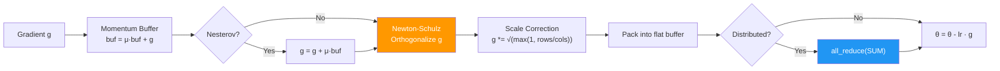

**Distributed work splitting**: In multi-GPU training, each rank only processes parameters where `param_index % world_size == rank`. After the Newton-Schulz step, all ranks contribute their updates into a single flat buffer and call `all_reduce(SUM)` to synchronize.

**Scale correction**: After orthogonalization, the update is scaled by $\sqrt{\max(1, \text{rows}/\text{cols})}$. This compensates for the aspect ratio of non-square weight matrices, ensuring the effective step size is comparable across layers with different shapes.

---

## 5. Tokenizer-Agnostic Evaluation (BPB)

The challenge allows participants to bring their own tokenizer. To compare fairly, the evaluation metric is **bits per byte (BPB)** rather than per-token loss. This is tokenizer-agnostic because it measures compression efficiency on raw UTF-8 bytes.

### 5.1 BPB Formula

$$\text{BPB} = \frac{\text{bits per token} \times \text{tokens}}{\text{bytes}} = \frac{H / \ln 2 \times N_{\text{tokens}}}{N_{\text{bytes}}}$$

where $H$ is the mean cross-entropy loss (in nats).

### 5.2 `build_sentencepiece_luts`

Builds three lookup tables (LUTs) indexed by token ID that let us count bytes efficiently on GPU:

| LUT                     | Shape                 | Description                                                                                   |
| ----------------------- | --------------------- | --------------------------------------------------------------------------------------------- |
| `base_bytes_lut`        | `(vocab_size,)` int16 | UTF-8 byte length of each token's text piece                                                  |
| `has_leading_space_lut` | `(vocab_size,)` bool  | Whether the token starts with the SentencePiece `▁` (space) marker                            |
| `is_boundary_token_lut` | `(vocab_size,)` bool  | True for control/unknown/unused tokens (boundaries that don't contribute leading-space bytes) |

**The leading-space correction**: SentencePiece's `▁` marker represents a space that was in the original text, but the `▁` character itself is not one UTF-8 byte — the original space was. The LUT adds 1 byte for `▁` tokens only when the previous token is _not_ a boundary token, correctly counting the space byte.

### 5.3 `eval_val`

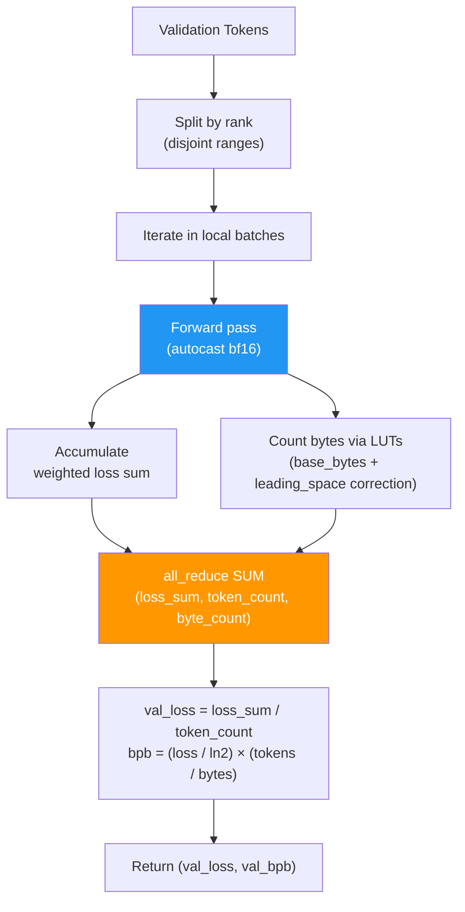

Key details:

- Uses `torch.inference_mode()` for no-grad evaluation
- Validation data is split across ranks for parallel evaluation, then `all_reduce`d
- Both `val_loss` (cross-entropy in nats) and `val_bpb` (bits per byte) are returned
- All accumulation uses `float64` to avoid precision issues over large validation sets

---

## 6. Post-Training Quantization

The model trains in bf16/fp32 but is serialized as **int8 + zlib** to fit under the 16 MB size cap. This is a _post-training_ quantization — no quantization-aware training is involved.

### 6.1 Quantization Strategy

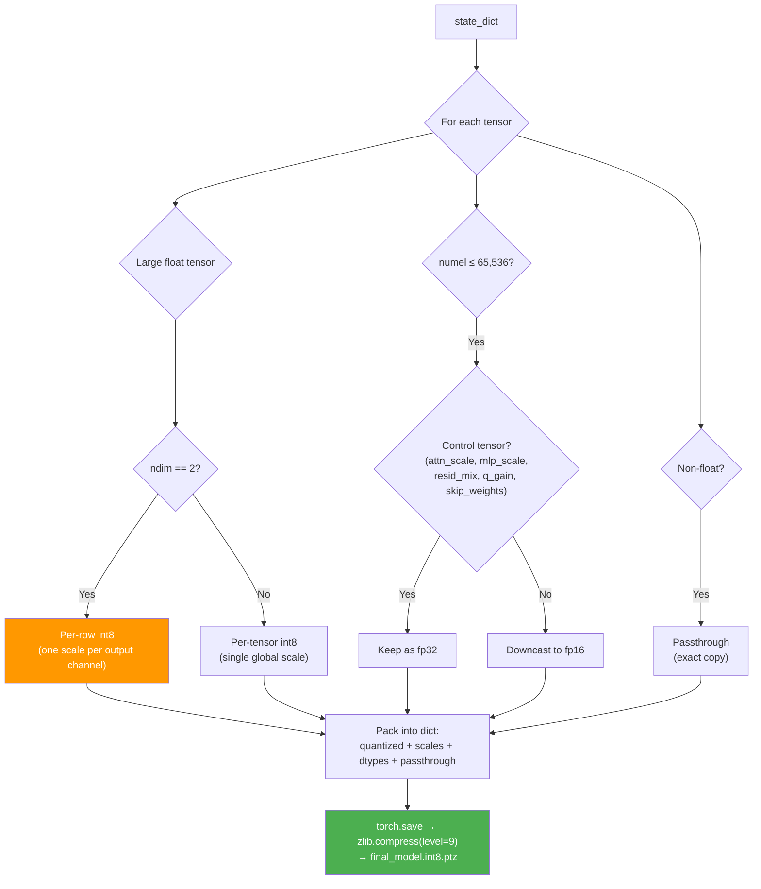

### 6.2 Percentile Clipping

Before quantizing, tensor values are clipped at the **99.99984th percentile** of absolute values. This removes extreme outliers that would otherwise waste quantization range:

$$\text{clip\_abs} = \text{quantile}(|W|, 0.9999984)$$

$$\text{scale} = \max\left(\frac{\text{clip\_abs}}{127}, \frac{1}{127}\right)$$

$$W_q = \text{clamp}\left(\text{round}\left(\frac{\text{clamp}(W, -\text{clip\_abs}, \text{clip\_abs})}{\text{scale}}\right), -127, 127\right)$$

### 6.3 Per-Row vs Per-Tensor Scales

| Tensor Type                  | Quantization       | Scale Shape    | Rationale                                              |
| ---------------------------- | ------------------ | -------------- | ------------------------------------------------------ |
| 2D matrices (weights)        | Per-row int8       | `(rows,)` fp16 | Output channels often have very different value ranges |
| 1D vectors / scalars         | Per-tensor int8    | scalar fp32    | Single scale suffices for small tensors                |
| Small tensors (≤ 65K params) | Passthrough (fp16) | —              | Quantization overhead would exceed savings             |
| Control tensors              | Passthrough (fp32) | —              | Precision-sensitive (scales, gains, mix weights)       |

### 6.4 Dequantization (`dequantize_state_dict_int8`)

Round-trip dequantization reverses the process:

- **Per-row**: $W = W_q \cdot \text{scale}[\text{row}]$, broadcast across columns
- **Per-tensor**: $W = W_q \cdot \text{scale}$
- **Passthrough**: restore original dtype from saved metadata

### 6.5 Serialization Format

The final artifact is `final_model.int8.ptz`:

1. Build a Python dict with `quantized`, `scales`, `dtypes`, `passthrough`, `qmeta`, `passthrough_orig_dtypes`
2. `torch.save()` to an in-memory `BytesIO` buffer
3. `zlib.compress(level=9)` the buffer
4. Write the compressed blob to disk

The format identifier is `int8_clean_per_row_v1`.

---

## 7. Data Loading

### 7.1 Shard Format (`load_data_shard`)

Each binary shard file has:

| Offset       | Content                  | Type                 |
| ------------ | ------------------------ | -------------------- |
| 0–1023 bytes | 256-integer header       | little-endian int32  |
| `header[0]`  | Magic number: `20240520` | int32                |
| `header[1]`  | Version: `1`             | int32                |
| `header[2]`  | Number of tokens         | int32                |
| 1024+ bytes  | Token data               | little-endian uint16 |

### 7.2 `TokenStream`

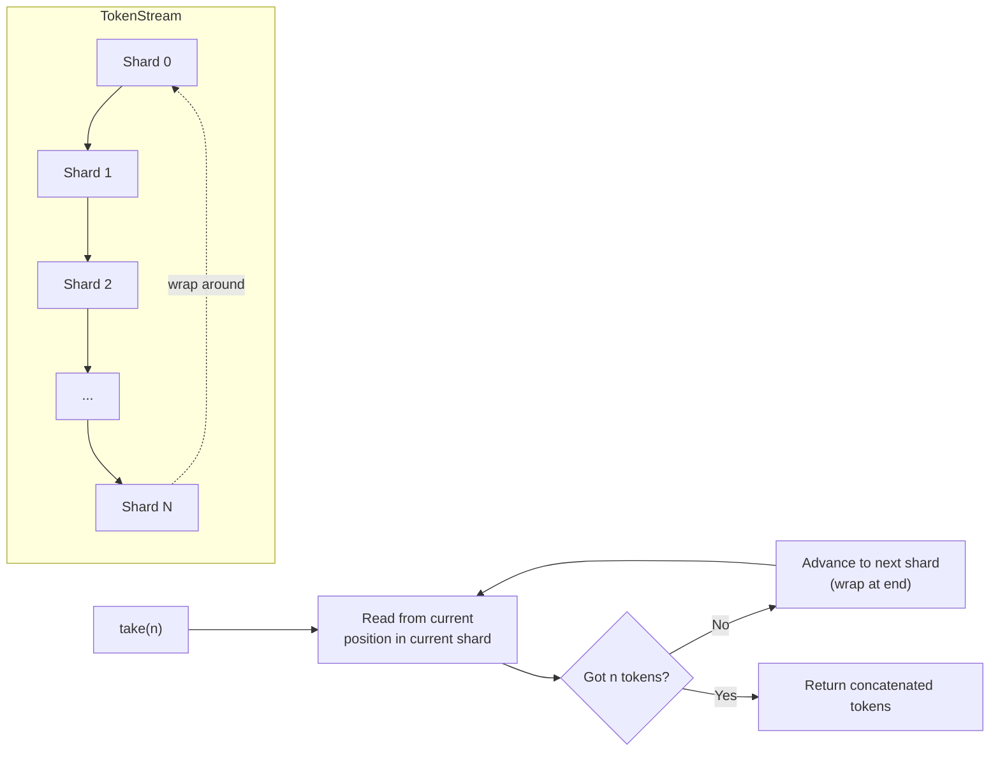

- Reads shards **sequentially** (no shuffling, no random access)
- Wraps around to the first shard when all shards are consumed → infinite stream
- Deterministic behavior: same tokens in same order every epoch

### 7.3 `DistributedTokenLoader`

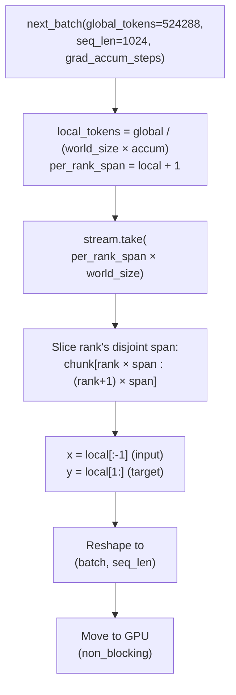

The `+1` token trick: by taking one extra token per rank, the script creates input/target pairs by shifting: `x = tokens[:-1]`, `y = tokens[1:]`. This avoids wasting a full sequence boundary between batches.

---

## 8. Transformer Modules

### 8.1 RMSNorm

**Root Mean Square Layer Normalization** — a simpler alternative to LayerNorm that skips the mean-subtraction step:

$$\text{RMSNorm}(x) = \frac{x}{\sqrt{\frac{1}{d}\sum_{i=1}^d x_i^2 + \epsilon}}$$

Unlike standard LayerNorm, this implementation has **no learnable affine parameters** (no gain/bias). It uses PyTorch's built-in `F.rms_norm` for efficiency.

**Used in 5 locations**:

1. Post-embedding normalization (in `GPT.forward`)
2. QK normalization (in `CausalSelfAttention.forward`, applied to Q and K separately)
3. Pre-attention norm (in `Block`, via `attn_norm`)
4. Pre-MLP norm (in `Block`, via `mlp_norm`)
5. Final norm before output projection (in `GPT`, via `final_norm`)

### 8.2 CastedLinear

A subclass of `nn.Linear` that **stores weights in fp32** but **casts them to the input dtype** (typically bf16) at forward time:

```
weight (stored fp32) ──cast to bf16──→ F.linear(x_bf16, weight_bf16)
```

This gives the optimizer fp32-quality weight updates while keeping the forward/backward pass in bf16 for speed. The `_zero_init` attribute flags certain layers (output projections) for zero-initialization.

### 8.3 Rotary Position Embeddings (RoPE)

RoPE encodes positional information by **rotating** query and key vectors in 2D subspaces, indexed by position.

#### Frequency Computation

$$\theta_i = \frac{1}{\text{base}^{2i/d}}, \quad i = 0, 1, \ldots, d/2 - 1$$

where `base = 10,000` and `d = head_dim = 64`.

#### Rotation Application

For a vector $x = [x_1, x_2]$ split into two halves at position $t$:

$$\text{RoPE}(x, t) = \begin{bmatrix} x_1 \cos(t\theta) + x_2 \sin(t\theta) \\ -x_1 \sin(t\theta) + x_2 \cos(t\theta) \end{bmatrix}$$

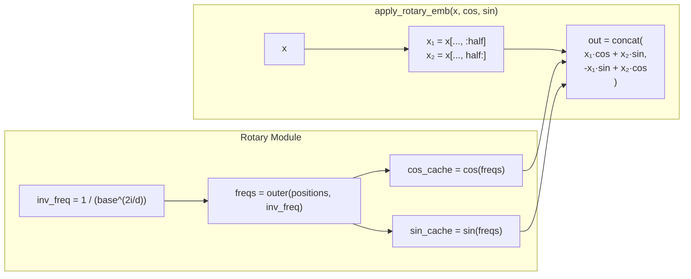

The `Rotary` module **caches** cos/sin tables keyed by sequence length and device to avoid recomputation. Shape after expanding: `(1, 1, seq_len, head_dim/2)` — broadcasts over batch and head dimensions.

### 8.4 CausalSelfAttention

The attention module implements **Grouped Query Attention (GQA)** with QK normalization and learnable query scaling.

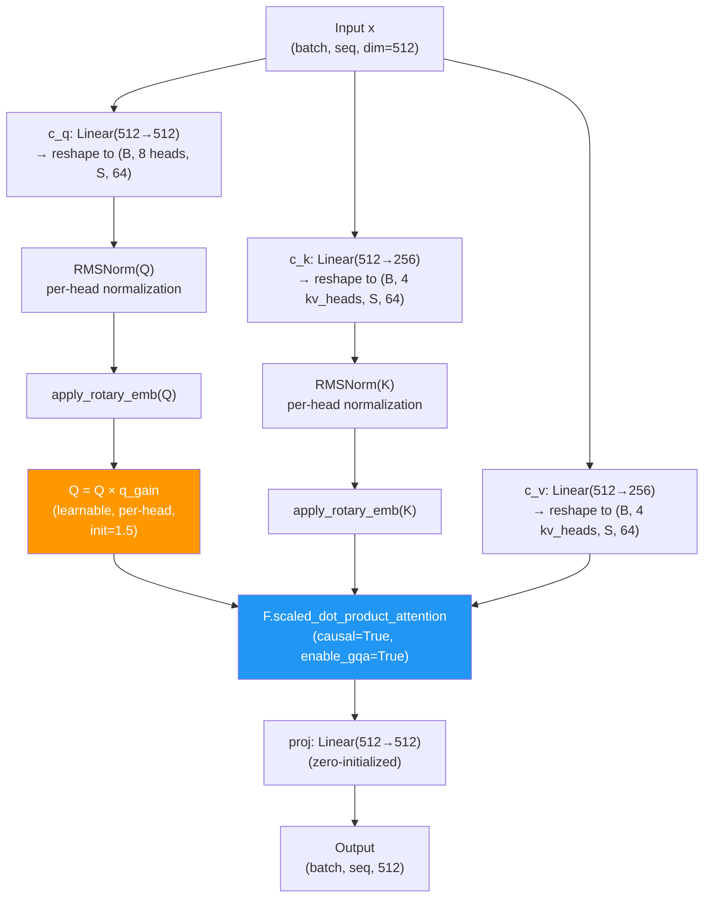

#### Grouped Query Attention (GQA)

With `num_heads=8` and `num_kv_heads=4`, each KV head is shared by 2 Q heads. This reduces KV memory and compute by 2× while retaining most of the attention capacity.

| Component | Heads | Dim per head | Total dim |
| --------- | ----- | ------------ | --------- |
| Q         | 8     | 64           | 512       |
| K         | 4     | 64           | 256       |
| V         | 4     | 64           | 256       |

PyTorch's `F.scaled_dot_product_attention` handles the GQA broadcasting automatically when `enable_gqa=True`.

#### QK Normalization + Q Gain

Before RoPE, both Q and K are **RMS-normalized per head**. This stabilizes attention logits regardless of activation magnitudes. After normalization and RoPE:

$$\text{attn}(Q, K) = \frac{(\gamma_Q \cdot \hat{Q}_{\text{rope}}) \cdot \hat{K}_{\text{rope}}^T}{\sqrt{d_k}}$$

The `q_gain` ($\gamma_Q$) is a **learnable, per-head scalar** initialized to 1.5. Scaling only Q (not K) is sufficient because:

$$\gamma_Q \hat{Q} \cdot \hat{K}^T = \hat{Q} \cdot (\gamma_Q \hat{K})^T$$

Mathematically, scaling Q by $\gamma$ is equivalent to scaling K by $\gamma$ — they both multiply the dot product by $\gamma$. Applying it to one side avoids redundancy.

#### Zero-Init Output Projection

The `proj` layer is zero-initialized (`_zero_init = True`). At the start of training, the attention block contributes nothing to the residual stream, making the initial model effectively a simple embedding → output projection.

### 8.5 MLP

A two-layer feedforward network with **squared ReLU** activation (from the modded-nanogpt):

$$\text{MLP}(x) = W_{\text{proj}} \cdot \text{ReLU}(W_{\text{fc}} \cdot x)^2$$

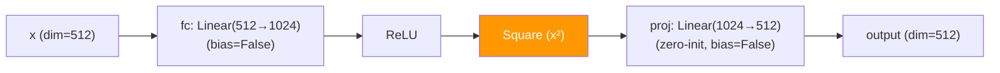

The squared ReLU ($\text{ReLU}(x)^2$) provides:

- **Sparsity**: Like ReLU, negative values are zeroed
- **Smoothness**: The squaring makes the activation differentiable at 0
- **Sharpness**: Larger activations are amplified quadratically, creating sparser effective representations

Hidden dimension = `mlp_mult × dim = 2 × 512 = 1024`.

### 8.6 Block

A single transformer layer combining attention and MLP with several modern techniques.

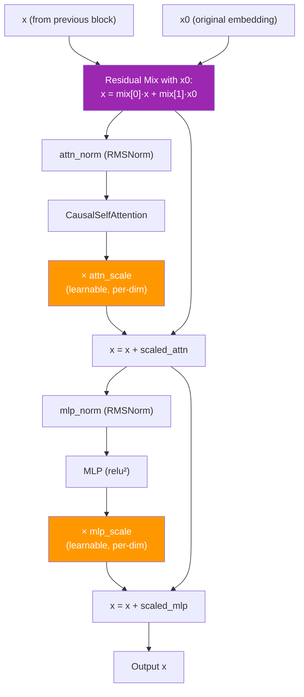

#### Residual Mix (`resid_mix`)

Each block blends the current hidden state `x` with the **original post-embedding representation** `x0`:

$$x' = \alpha \odot x + \beta \odot x_0$$

where $\alpha$ = `resid_mix[0]` (init: all ones) and $\beta$ = `resid_mix[1]` (init: all zeros). Per-dimension learnable parameters (shape `(2, dim)`).

This provides a **direct gradient highway** from any block back to the input embedding, combating vanishing gradients in deep networks. At initialization, $\alpha=1, \beta=0$, so the block starts as a standard residual.

#### Learnable Residual Scales

Both `attn_scale` and `mlp_scale` are per-dimension vectors (init: all ones) that scale the sub-layer outputs before adding to the residual:

$$x = x + \text{attn\_scale} \odot \text{Attn}(\text{Norm}(x))$$
$$x = x + \text{mlp\_scale} \odot \text{MLP}(\text{Norm}(x))$$

These allow the model to learn per-dimension importance for each sub-layer's contribution.

### 8.7 GPT (Full Model)

The top-level model class implements the full forward pass with **U-Net skip connections**.

#### U-Net Architecture

With `num_layers=9`:

- **Encoder**: first `9 // 2 = 4` blocks (indices 0–3)
- **Decoder**: remaining `9 - 4 = 5` blocks (indices 4–8)
- **Skip connections**: 4 (one per encoder block)

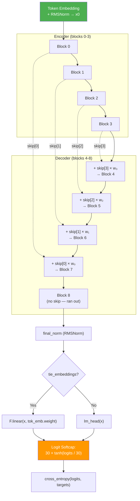

Encoder blocks store their outputs onto a stack; decoder blocks pop from the stack (LIFO = reverse order). Each skip connection has a **learnable per-dimension weight** `skip_weights[i]`:

$$x = x + \text{skip\_weight}_i \odot \text{skip}_i$$

Since encoder has 4 blocks and decoder has 5, the last decoder block (Block 8) runs without a skip connection.

#### Logit Softcapping

Output logits are clamped into $[-30, +30]$ via:

$$\text{logits} = 30 \cdot \tanh\left(\frac{\text{raw\_logits}}{30}\right)$$

This prevents extreme logit values from destabilizing training and is borrowed from Gemma-2/PaLM architectures.

#### Weight Initialization

- **Tied embeddings**: `Normal(0, 0.005)` — small std because tied weights serve double duty
- **Zero-init projections**: All layers with `_zero_init = True` (`attn.proj`, `mlp.proj`, optional `lm_head`) are zero-initialized, making the initial model a near-identity function through the residual path

---

## 9. Training (`main()`)

### 9.1 Distributed + CUDA Setup

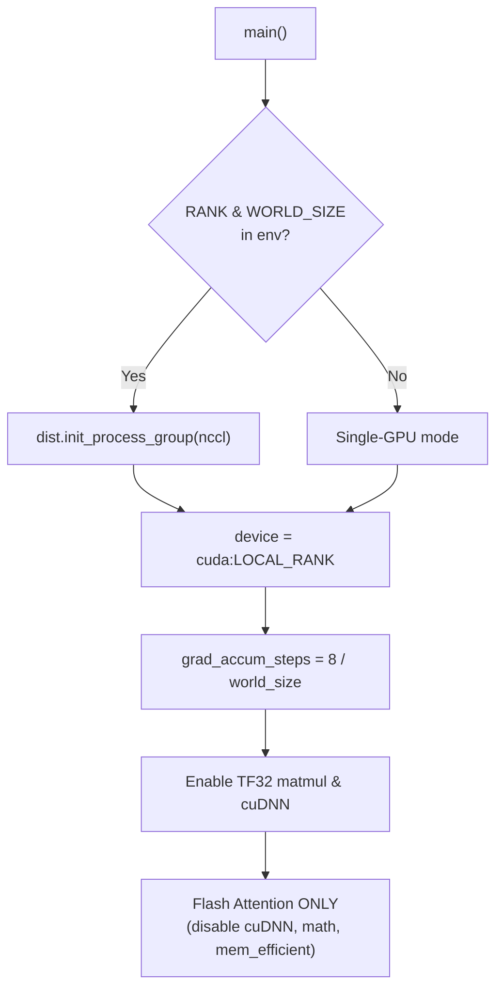

Key points:

- **`grad_accum_steps = 8 // world_size`**: With 8 GPUs, no accumulation; with 1 GPU, 8 micro-steps per optimization step. The "8" is hardcoded so `world_size` must divide 8.
- **TF32**: Enabled for both matmul and cuDNN — provides ~2× speedup on Ampere+ GPUs with negligible accuracy loss.
- **SDP backend**: Only **Flash Attention** is enabled; cuDNN, math, and memory-efficient backends are disabled. Flash Attention is fastest for causal masking.

### 9.2 Tokenizer + Validation Setup

1. Seeds all RNGs (Python `random`, NumPy, PyTorch CPU + CUDA) with `seed=1337`
2. Loads the SentencePiece tokenizer and validates vocab size matches
3. Loads the full validation token set (pre-tokenized binary shards)
4. Builds the 3 BPB lookup tables on GPU

### 9.3 Model + Optimizer Setup

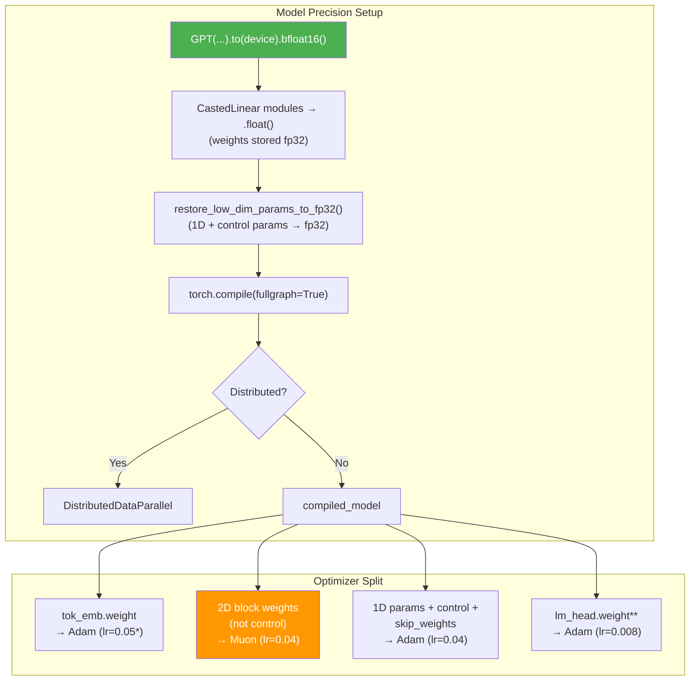

_\* `tied_embed_lr=0.05` when tied, `embed_lr=0.6` when untied_
_\*\* Only exists when `tie_embeddings=False`_

**Parameter routing rules**:

| Parameter Type        | Criterion                          | Optimizer    | LR                         |
| --------------------- | ---------------------------------- | ------------ | -------------------------- |
| Token embedding       | `tok_emb.weight`                   | Adam (fused) | 0.05 (tied) / 0.6 (untied) |
| LM head               | `lm_head.weight` (if exists)       | Adam (fused) | 0.008                      |
| Block matrices        | `ndim == 2` and not control tensor | Muon         | 0.04                       |
| Block scalars/vectors | `ndim < 2` or control tensor name  | Adam (fused) | 0.04                       |
| Skip weights          | `skip_weights`                     | Adam (fused) | 0.04                       |

Control tensor names matching: `attn_scale`, `mlp_scale`, `resid_mix`, `q_gain`, `skip_weight[s]`.

### 9.4 Compilation Warmup

`torch.compile` has non-trivial first-run overhead (tracing, code generation). The warmup phase:

1. **Save** initial model state + optimizer states to CPU
2. **Run** `warmup_steps=20` full training steps (forward + backward + optimizer)
3. **Restore** the saved initial state — weights and optimizer states reset to their original values
4. **Recreate** the data loader so token ordering is deterministic from the true start

This ensures the measured training time doesn't include compilation overhead, which can be 30+ seconds.

### 9.5 Learning Rate Schedule

The LR schedule has **no warmup ramp** — it starts at full LR and applies a **linear warmdown** at the end of training:

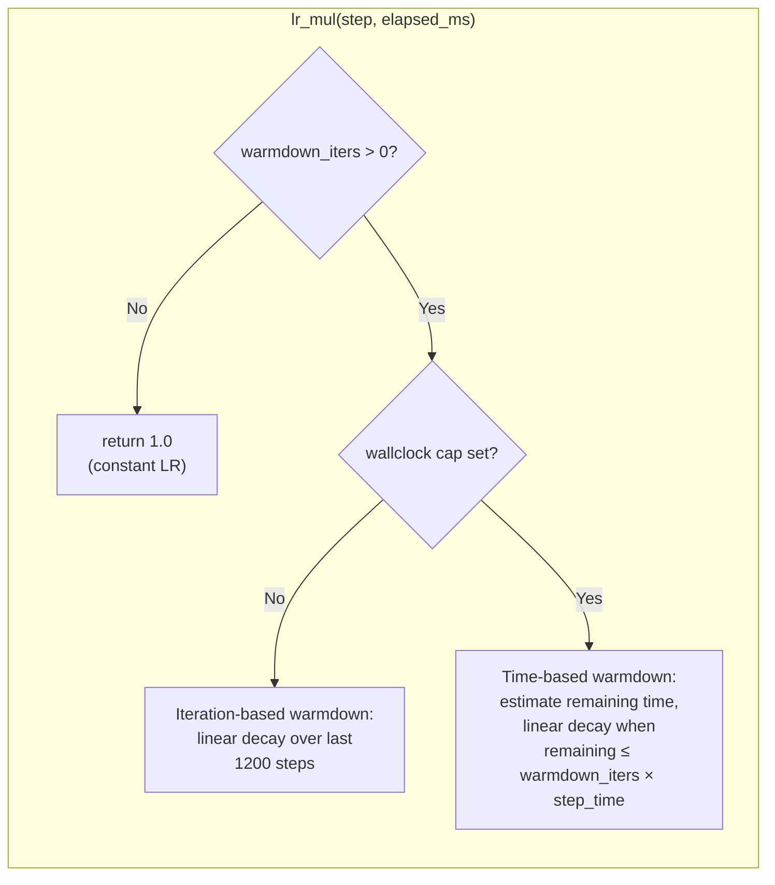

**Time-based warmdown** (the default path since `max_wallclock_seconds=600`):

$$\text{step\_time} = \frac{\text{elapsed\_ms}}{\text{step}}$$
$$\text{warmdown\_ms} = \text{warmdown\_iters} \times \text{step\_time}$$
$$\text{remaining\_ms} = \text{max\_wallclock\_ms} - \text{elapsed\_ms}$$

$$\text{lr\_mul} = \begin{cases} 1.0 & \text{if remaining > warmdown\_ms} \\ \frac{\text{remaining\_ms}}{\text{warmdown\_ms}} & \text{otherwise (linear decay to 0)} \end{cases}$$

This is adaptive: the warmdown region expands or contracts based on the actual step time, ensuring the LR reaches ~0 right as the wall-clock cap is hit.

### 9.6 Main Training Loop

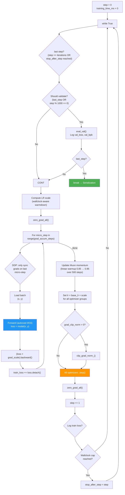

#### Gradient Accumulation

With `train_batch_tokens=524,288`, `seq_len=1024`, and `grad_accum_steps=8` (1 GPU):

$$\text{micro-batch} = \frac{524{,}288}{1 \times 8} = 65{,}536 \text{ tokens} = 64 \text{ sequences}$$

Gradients sync only on the **last micro-step** (`require_backward_grad_sync = micro_step == grad_accum_steps - 1`), reducing DDP communication by 8×.

#### Muon Momentum Warmup

Muon's momentum ramps linearly from 0.85 to 0.95 over the first 500 steps:

$$\mu_t = (1 - f) \times 0.85 + f \times 0.95, \quad f = \min\left(\frac{t}{500}, 1\right)$$

#### Distributed Wallclock Sync

When any rank hits the 10-minute cap, all ranks must agree to stop at the _same step_. This is achieved via `all_reduce(MAX)` on a flag tensor — if any rank sets it to 1, all ranks see 1 and set `stop_after_step`, which takes effect after the next validation.

### 9.7 Serialization + Round-Trip Validation

After training ends:

1. **Raw save**: `final_model.pt` — the standard PyTorch state dict (useful for debugging)
2. **Quantized save**: `final_model.int8.ptz` — int8 quantized + zlib level-9 compressed
3. **Round-trip validation**: Load `.int8.ptz` from disk → decompress → dequantize → load into model → run full validation → report `val_loss` and `val_bpb`

The round-trip step verifies the quantized model actually works and reports the final challenge score.

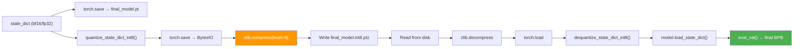

---

## 10. Appendix: Hyperparameter Reference Table

Complete table of all hyperparameters with their environment variable names and defaults:

| Env Variable                 | Field                        | Default                                    | Type  | Category   |
| ---------------------------- | ---------------------------- | ------------------------------------------ | ----- | ---------- |
| `DATA_PATH`                  | `data_path`                  | `./data/datasets/fineweb10B_sp1024`        | str   | Data       |
| `TOKENIZER_PATH`             | `tokenizer_path`             | `./data/tokenizers/fineweb_1024_bpe.model` | str   | Data       |
| `RUN_ID`                     | `run_id`                     | random UUID                                | str   | I/O        |
| `SEED`                       | `seed`                       | 1337                                       | int   | I/O        |
| `VAL_BATCH_SIZE`             | `val_batch_size`             | 524,288                                    | int   | Validation |
| `VAL_LOSS_EVERY`             | `val_loss_every`             | 1,000                                      | int   | Validation |
| `TRAIN_LOG_EVERY`            | `train_log_every`            | 200                                        | int   | Logging    |
| `ITERATIONS`                 | `iterations`                 | 20,000                                     | int   | Training   |
| `WARMDOWN_ITERS`             | `warmdown_iters`             | 1,200                                      | int   | Training   |
| `WARMUP_STEPS`               | `warmup_steps`               | 20                                         | int   | Training   |
| `TRAIN_BATCH_TOKENS`         | `train_batch_tokens`         | 524,288                                    | int   | Training   |
| `TRAIN_SEQ_LEN`              | `train_seq_len`              | 1,024                                      | int   | Training   |
| `MAX_WALLCLOCK_SECONDS`      | `max_wallclock_seconds`      | 600.0                                      | float | Training   |
| `QK_GAIN_INIT`               | `qk_gain_init`               | 1.5                                        | float | Model      |
| `VOCAB_SIZE`                 | `vocab_size`                 | 1,024                                      | int   | Model      |
| `NUM_LAYERS`                 | `num_layers`                 | 9                                          | int   | Model      |
| `NUM_KV_HEADS`               | `num_kv_heads`               | 4                                          | int   | Model      |
| `MODEL_DIM`                  | `model_dim`                  | 512                                        | int   | Model      |
| `NUM_HEADS`                  | `num_heads`                  | 8                                          | int   | Model      |
| `MLP_MULT`                   | `mlp_mult`                   | 2                                          | int   | Model      |
| `TIE_EMBEDDINGS`             | `tie_embeddings`             | 1 (True)                                   | bool  | Model      |
| `ROPE_BASE`                  | `rope_base`                  | 10,000.0                                   | float | Model      |
| `LOGIT_SOFTCAP`              | `logit_softcap`              | 30.0                                       | float | Model      |
| `EMBED_LR`                   | `embed_lr`                   | 0.6                                        | float | Optimizer  |
| `HEAD_LR`                    | `head_lr`                    | 0.008                                      | float | Optimizer  |
| `TIED_EMBED_LR`              | `tied_embed_lr`              | 0.05                                       | float | Optimizer  |
| `TIED_EMBED_INIT_STD`        | `tied_embed_init_std`        | 0.005                                      | float | Optimizer  |
| `MATRIX_LR`                  | `matrix_lr`                  | 0.04                                       | float | Optimizer  |
| `SCALAR_LR`                  | `scalar_lr`                  | 0.04                                       | float | Optimizer  |
| `MUON_MOMENTUM`              | `muon_momentum`              | 0.95                                       | float | Optimizer  |
| `MUON_BACKEND_STEPS`         | `muon_backend_steps`         | 5                                          | int   | Optimizer  |
| `MUON_MOMENTUM_WARMUP_START` | `muon_momentum_warmup_start` | 0.85                                       | float | Optimizer  |
| `MUON_MOMENTUM_WARMUP_STEPS` | `muon_momentum_warmup_steps` | 500                                        | int   | Optimizer  |
| `BETA1`                      | `beta1`                      | 0.9                                        | float | Optimizer  |
| `BETA2`                      | `beta2`                      | 0.95                                       | float | Optimizer  |
| `ADAM_EPS`                   | `adam_eps`                   | 1e-8                                       | float | Optimizer  |
| `GRAD_CLIP_NORM`             | `grad_clip_norm`             | 0.0                                        | float | Optimizer  |

---

_Generated from `train_gpt.py` — parameter-golf project._
